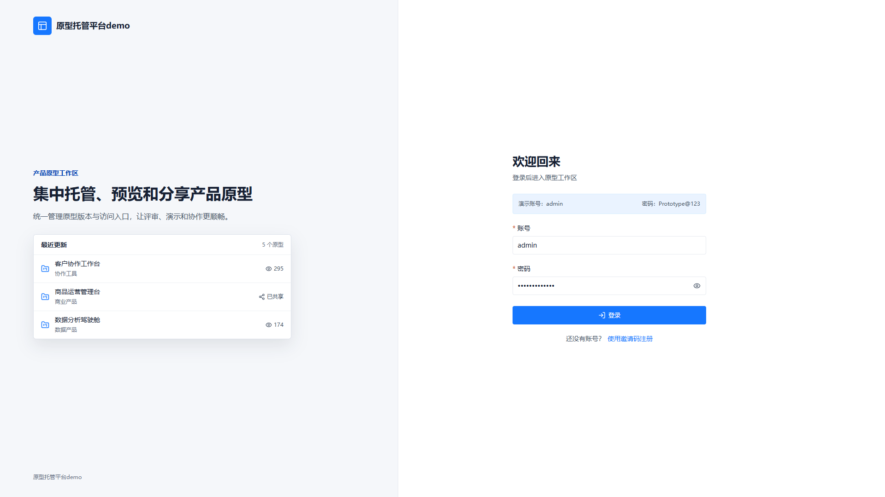
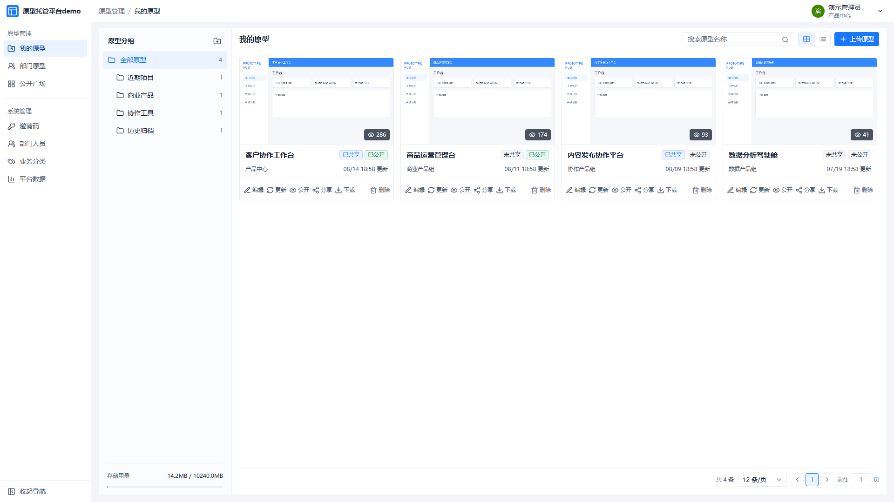
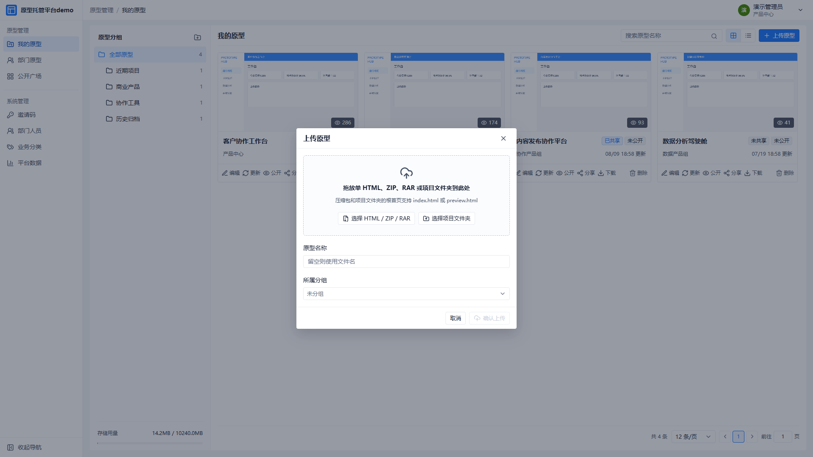
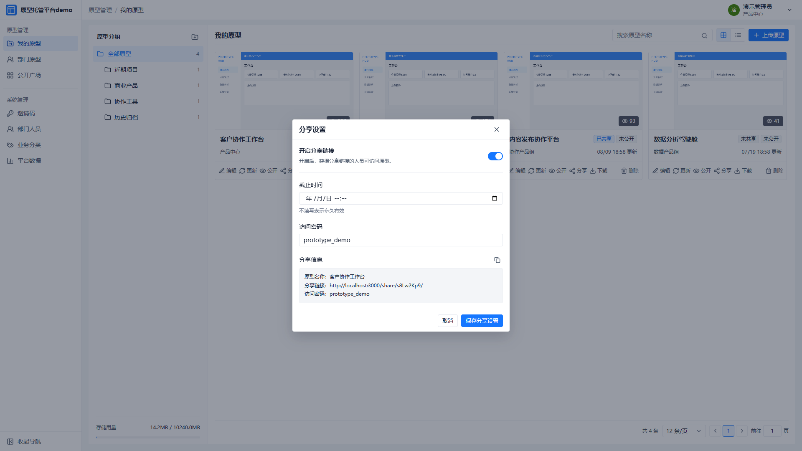
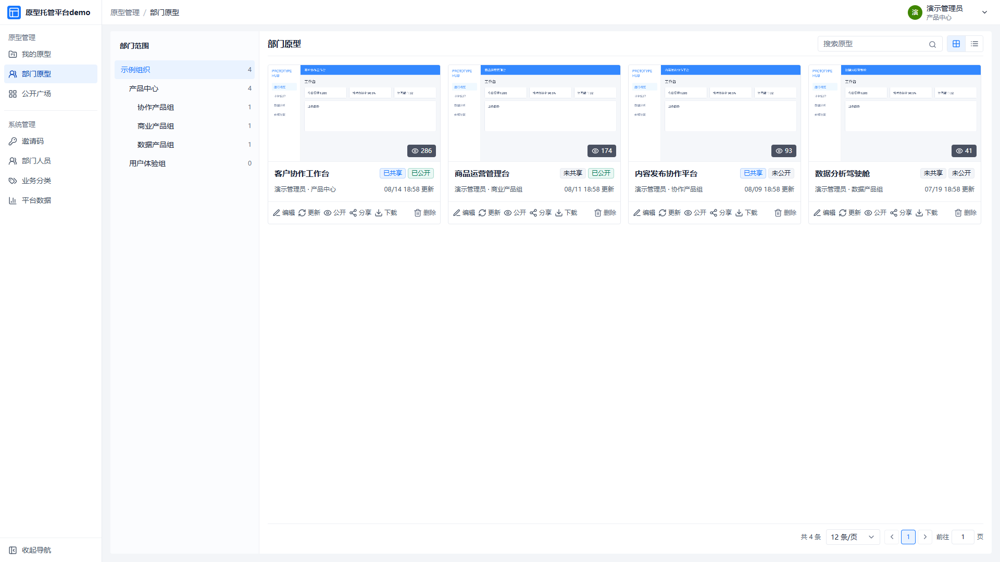
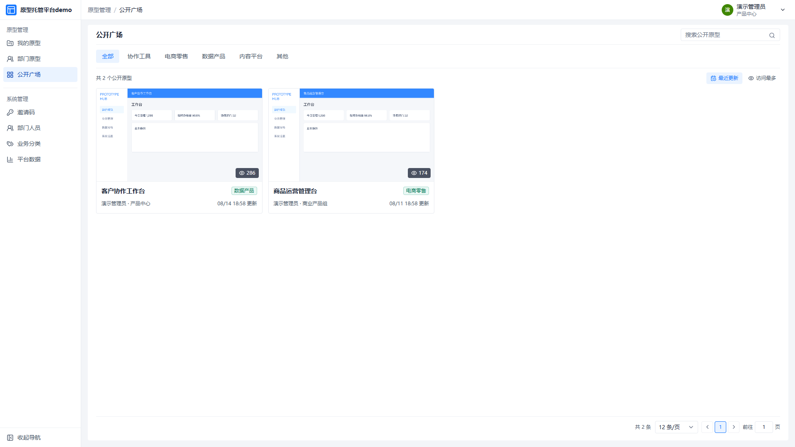
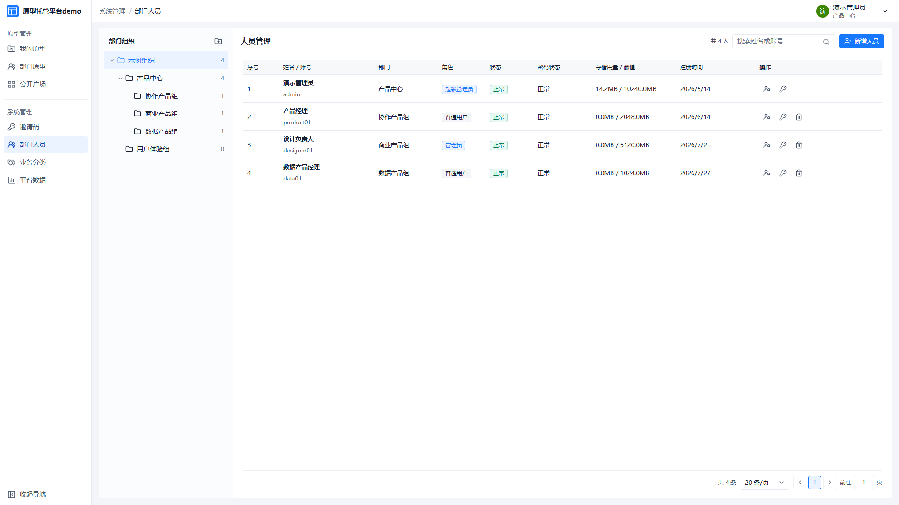
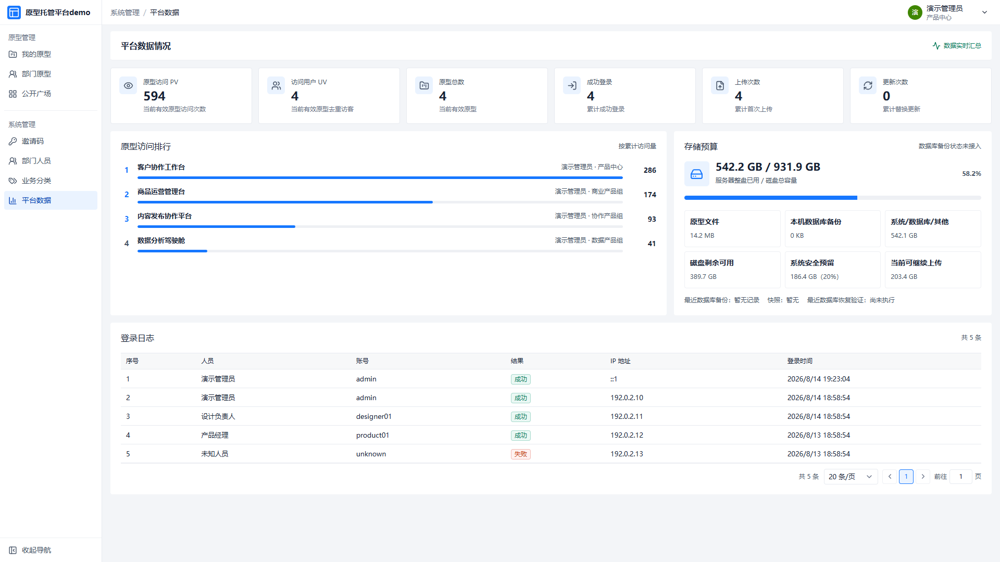
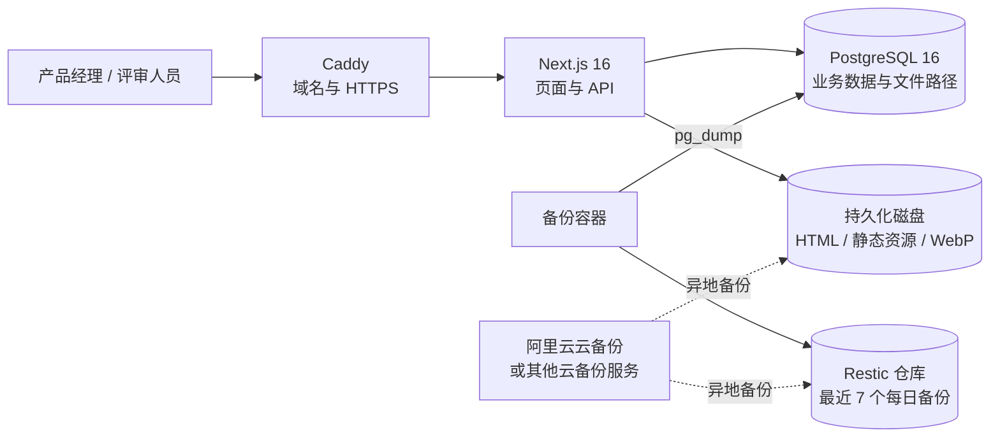

# 原型html托管平台

[](https://github.com/lin96008-maxlin/prototype-html-hosting-platform/actions/workflows/ci.yml)
[](./LICENSE)
[](https://nextjs.org/)
[](https://react.dev/)

一个面向各行业产品经理、设计师和产品团队的开源原型资产托管平台。

在 Vibe Coding（自然语言协同编程）时代，产品经理会快速产出大量 HTML 原型、AI 生成页面和可交互演示；传统工作中也仍有大量 Axure 导出的 HTML 文件夹。文件如果长期散落在本地、网盘和聊天记录中，版本、访问入口、权限和复用价值都会迅速失控。

原型html托管平台把这些文件产物转化为可持续管理的团队资产：统一上传、自动生成首页预览图、在线访问、版本更新、链接分享、访问密码、团队内公开共享、公开广场和使用数据统计。



## 平台价值

- **统一管理 Vibe 产物**：集中保存 AI IDE、代码智能体和各类原型工具生成的 HTML 产物，不再依赖个人电脑和临时链接。
- **兼容传统 Axure 工作流**：支持上传单 HTML、ZIP、RAR 或项目文件夹，可识别根目录中的 `index.html` 或 `preview.html`。
- **让评审链接长期稳定**：原型更新后访问入口保持不变，减少“请以最后一个压缩包为准”的沟通成本。
- **控制分享边界**：可开启或关闭分享、设置截止时间和访问密码，适合客户演示、方案评审和跨团队协作。
- **沉淀团队知识资产**：个人原型可在部门内共享，也可进入公开广场，方便同事检索、参考和复用。
- **具备基础治理能力**：提供部门、人员、角色、业务分类、存储配额、访问量和登录日志管理。

## 功能截图

### 原型资产工作区

以分组、卡片或列表管理原型，查看首页预览、公开状态、分享状态、访问量和更新时间。



### HTML、压缩包与 Axure 文件夹上传

支持拖放单 HTML、ZIP、RAR 或完整项目文件夹。Axure 导出内容可直接以压缩包或文件夹方式上传。



### 分享、访问密码与有效期

为每个原型单独生成分享链接，可配置截止时间和访问密码，并一键复制完整分享信息。



### 团队内原型共享

按组织部门查看团队原型，超级管理员和部门管理员可在授权范围内维护资产。



### 公开广场

将允许公开的原型按业务分类汇总，支持检索和按最近更新、访问最多排序。



### 组织、角色与配额

维护部门树、人员角色、账号状态、密码状态和个人存储配额。



### 平台数据与运行状态

查看原型 PV、UV、上传与更新次数、访问排行、磁盘预算、备份状态和登录日志。



## 主要特性

| 领域 | 能力 |
| --- | --- |
| 原型接入 | 单 HTML、ZIP、RAR、项目文件夹；支持 `index.html` 与 `preview.html` 入口 |
| 在线访问 | 原型文件及相对路径资源同域访问，自动生成 WebP 首页截图 |
| 资产管理 | 分组、业务分类、搜索、卡片/列表视图、替换更新、下载与删除 |
| 分享控制 | 独立分享链接、开关、截止时间、访问密码、分享信息复制 |
| 团队协作 | 我的原型、部门原型、公开广场、部门范围管理 |
| 权限模型 | 超级管理员、管理员、普通用户三级角色 |
| 平台治理 | 邀请码注册、部门人员、账号状态、强制改密、存储配额 |
| 数据统计 | PV、UV、上传/更新次数、原型排行、登录日志、磁盘预算 |
| 运维保障 | 健康检查、Docker Compose、Caddy HTTPS、Restic 数据库备份与隔离恢复验证 |

## 技术方案

| 组件 | 职责 |
| --- | --- |
| **Next.js 16 + React 19 + TypeScript** | 管理端、原型访问页和服务端 API |
| **PostgreSQL 16** | 账号、部门、权限、原型元数据、访问量和日志 |
| **本地持久化磁盘** | HTML 原型文件、关联静态资源和 WebP 首页截图 |
| **Caddy** | 按域名转发，并自动申请和续期 HTTPS 证书 |
| **Docker Compose** | 一次启动应用、PostgreSQL、Caddy 网关和备份服务 |
| **Restic** | 本机保存最近 7 个 PostgreSQL 每日备份；失败自动重试，并支持定期隔离恢复验证 |
| **阿里云云备份** | 在云厂商侧对服务器文件做异地备份，其中可包含原型文件、预览图和本机备份仓库 |
| **Vitest + Playwright** | 单元测试、接口验证和端到端流程检查 |



### 数据存储边界

HTML 原型内容**不写入数据库字段**。PostgreSQL 只保存账号、权限、原型名称、业务信息、访问统计和文件路径；HTML、JavaScript、CSS、图片等原型文件，以及自动生成的 WebP 预览图，存放在服务器持久化卷中。

这种设计避免大文件挤占数据库，也方便对文件资产和数据库采用不同的备份策略。项目可部署到阿里云、腾讯云、华为云或其他能够运行 Docker 的 Ubuntu 云服务器。

Restic 负责本机 PostgreSQL 日常备份；原型文件和预览图建议使用阿里云云备份、云硬盘快照或其他云厂商文件备份服务做异地保护。云备份需要在对应云厂商控制台单独开通，本仓库不会自动创建或绑定任何云账号资源。

## 目录结构

| 路径 | 用途 |
| --- | --- |
| `src/` | 页面、组件、服务端 API 和核心业务逻辑 |
| `database/` | PostgreSQL 数据库迁移脚本 |
| `deploy/` | Dockerfile、Docker Compose 与 Caddy 部署配置 |
| `config/` | ESLint、Vitest 与 Playwright 工具配置 |
| `docker/`、`scripts/` | 容器启动、数据库初始化和 Restic 备份脚本 |
| `tests/` | Playwright 端到端测试及测试素材 |
| `docs/` | 部署、备份说明和功能截图 |
| `.github/` | 持续集成、贡献指南和安全说明 |
| 根目录配置文件 | Next.js、TypeScript、npm 和环境变量模板 |

仓库不包含 `node_modules`、构建产物、数据库文件、上传内容或任何真实环境密钥。

## 本地体验

环境要求：Node.js 22、npm。

```bash
npm ci
npm run dev
```

打开 `http://localhost:3000/login`：

- 演示账号：`admin`
- 演示密码：`Prototype@123`

未配置 PostgreSQL 时，本地开发环境使用内存演示数据，重启后会恢复初始状态。演示账号只用于本地体验，生产环境不会启用演示模式。

## Docker 部署

环境要求：Ubuntu 云服务器、Docker Engine、Docker Compose 插件、已解析到服务器的域名。

1. 基于 `.env.example` 创建 `.env`。
2. 分别生成数据库密码、会话签名密钥、分享密码加密密钥、Restic 仓库密码和首位管理员密码。
3. 修改域名与管理员信息，禁止沿用示例值。
4. 启动应用、数据库、网关和备份服务：

```bash
docker compose -f deploy/compose.yml --profile standalone-proxy up -d --build
```

默认站点前缀为 `/manage`：

- 管理端：`https://你的域名/manage`
- 公开原型：`https://你的域名/manage/project/{code}`
- 分享原型：`https://你的域名/manage/share/{code}`

`NEXT_PUBLIC_BASE_PATH` 在构建时和运行时必须保持一致。详细步骤见 [部署说明](./docs/部署说明.md)、[自动部署说明](./docs/自动部署说明.md)、[同域路径接入说明](./docs/同域路径接入说明.md) 和 [备份与恢复说明](./docs/备份与恢复说明.md)。

## 质量检查

```bash
npm run lint
npm run typecheck
npm test
npm run build
npm run test:e2e
```

GitHub Actions 会在推送和 Pull Request 时自动执行代码规范、类型、单元测试和生产构建检查。服务器部署由使用者根据自己的域名、网络和密钥环境独立配置。

## 安全说明

- 不要提交 `.env`、数据库文件、SSH Key、真实域名、客户原型或生产数据。
- 生产环境必须使用独立随机密码，不要使用 README 中的演示账号密码。
- 分享密码在数据库中采用加密字段保存，登录密码采用不可逆哈希保存。
- 建议定期执行 Restic 隔离恢复验证，而不仅仅检查“备份任务成功”。
- 安全问题请按 [安全说明](./.github/SECURITY.md) 私下报告。

## 参与贡献

欢迎产品经理、设计师和开发者通过 Issue 提交使用场景、功能建议和问题反馈。提交代码前请阅读 [贡献指南](./.github/CONTRIBUTING.md)。

## 开源许可

本项目使用 [MIT License](./LICENSE)。你可以学习、修改和二次开发，但请自行评估生产部署、安全与数据合规要求。
